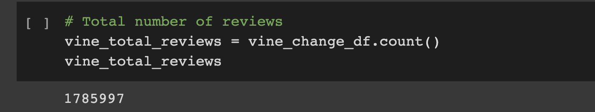
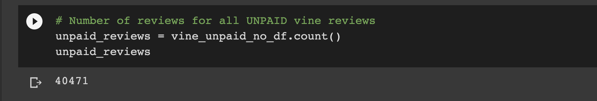
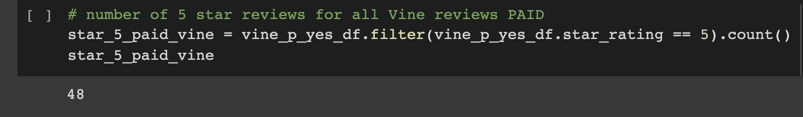
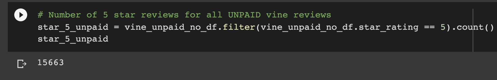
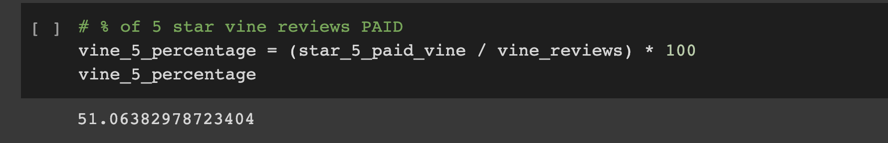
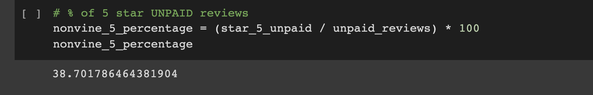

# Amazon_Vine_Analyis

## Overview
To analyze Amazon reviews written by members of the paid Amazon Vine program.  The Amazon Vine program is a service that allows manufacturers and publishers to recieve reviews for their products.
### Purpose
Pick one of 50 datasets and use PySpark to perform the ETL process to extract the dataset, transform the data, connect to an AWS RDS instance, and load the transformed data into pgAdmin.  Use PySpark, Pandas, or SQL to determine if thereis any bias toward favorable reviews from Vine members in the dataset.  Write a summary of the analyis.
### Resources
- Data Source: amazon_reviews_us_Video_Games_v1_00.tsv.gz
- Software, apps, libraries:
  - Python 3.6.1
  - Pandas
  - pgAdmin
  - Pyspark
  - AWS RDS

## Results of Analyis
  - How many Vine reviews and non-Vine reviews were there?
    ### Total Number of Reviews:
     
    
    ### Total Number of Vine Reviews:
    
 
 
    ### Total Number of Non-Vine Reviews:
    
  
  - How many Vine reviews were 5 stars?  How many non-Vine reviews were 5 stars?
    ### Total Vine Reviews with 5 Stars:
    
    ### Total Non-Vine Reviews with 5 Stars:
    
  - What percentage of Vine reviews were 5 stars?  What percentage of non-Vine reviews were 5 stars?
    ### Percentage of 5 Star Vine Reviews:
    
    ### Percentage of 5 Star Non-Vine Reviews:
    

## Summary
After reviewing the data, those are Vine users are 51% more likely to give a 5 star review while Non-Vine users are only 39% more likely to give a 5 star review.  There does appear to be a bias for Vine users to give 5 star reviews.  However, when you compare the number of reviews, 94 Vine reviews to 40,471 Non-Vine, the question needs to be asked is the sample size too small for Vine users to make an accurate assumption.   

How many Vine Users are there and are they posting less reviews than their non-vine user counterparts.  If this is the case, then the better question and an additional analysis would be are non-vine users more likely to post a review than Vine Users?  
    

